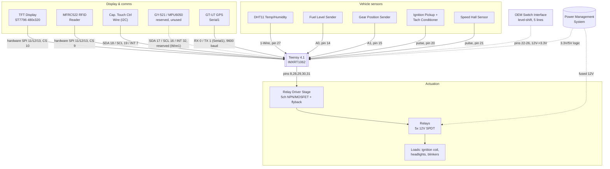
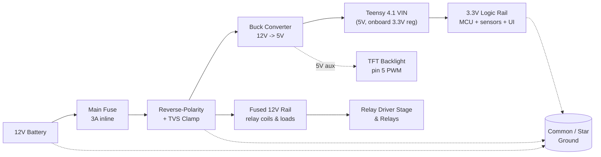

# Wiring & Power Reference

PCB design reference for the `teensy41-migration` branch. MCU is a
**Teensy 4.1** (PJRC, IMXRT1062). Generated from
[`lib/pinMap.h`](lib/pinMap.h), [`src/main.cpp`](src/main.cpp) and
[`src/RelayControl.cpp`](src/RelayControl.cpp) — not a fabrication-ready
schematic. See `docs/teensy-pinmap.md` for the migration rationale behind
each pin choice.

## System signal interconnect

Dashed links need interface circuitry beyond a direct GPIO wire — see
[Design notes](#design-notes).

## Power management system

The logic side (top) and the relay/load side (bottom) run on separate fused
branches off the same protected 12V node, tied to one ground reference.
Feed the Teensy through its **VIN pin (5V)**, not the USB connector — VIN
goes through the same onboard 3.3V regulator USB power would, but avoids
back-powering a host PC's USB port and tolerates automotive-grade 5V rail
noise better than the USB-spec input.

## Pin reference

### TFT Display — ST7796, hardware SPI

| Signal | Pin | Note |
|---|---|---|
| CS | 10 | chip select |
| DC | 2 | data/command |
| RST | 3 | reset |
| BL | 5 | backlight, PWM |
| MOSI | 11 | fixed hardware SPI, shared with MFRC522 |
| MISO | 12 | fixed hardware SPI, shared with MFRC522 |
| SCK | 13 | fixed hardware SPI, shared with MFRC522 — **also Teensy's onboard LED**, see note 1 |

### MFRC522 RFID — hardware SPI

| Signal | Pin | Note |
|---|---|---|
| CS | 9 | chip select |
| RST | 4 | reset |
| IRQ | 6 | card-present interrupt |
| MOSI | 11 | fixed hardware SPI, shared with TFT |
| MISO | 12 | fixed hardware SPI, shared with TFT |
| SCK | 13 | fixed hardware SPI, shared with TFT |

### Capacitive touch controller — Wire (I2C)

| Signal | Pin | Note |
|---|---|---|
| SDA | 18 | fixed hardware `Wire` pin |
| SCL | 19 | fixed hardware `Wire` pin |
| INT | 7 | touch interrupt |
| RST | — | not connected (-1) |

### GY-521 / MPU6050 — Wire1 (I2C), reserved

| Signal | Pin | Note |
|---|---|---|
| SDA | 17 | fixed hardware `Wire1` pin, defined, unused |
| SCL | 16 | fixed hardware `Wire1` pin, defined, unused |
| INT | 32 | defined, unused |

Not initialized by current firmware — route the footprint only if the IMU is planned.

### GT-U7 GPS — Serial1 (hardware UART)

| Signal | Pin | Note |
|---|---|---|
| RX (MCU) | 0 | fixed hardware `Serial1` pin, ← GPS TX |
| TX (MCU) | 1 | fixed hardware `Serial1` pin, → GPS RX |

9600 baud.

### Vehicle sensors

| Signal | Pin | Note |
|---|---|---|
| DHT11 data | 27 | 1-Wire, needs pull-up; see docs/library-compatibility.md for a Teensy-4.x timing caveat on this library |
| Fuel level | 14 | A0, analog in |
| Gear position | 15 | A1, analog in |
| Tach pulse | 20 | via conditioner, RISING |
| Speed (Hall) | 21 | RISING, 6 magnets/rev |

### OEM switch inputs — needs level shift

| Signal | Pin | Note |
|---|---|---|
| Turn signal L | 22 | active-low, pull-up |
| Turn signal R | 23 | active-low, pull-up |
| Hazard | 24 | active-low, pull-up |
| High beam sense | 25 | active-low, pull-up |
| Low beam sense | 26 | active-low, pull-up |

### Control outputs — to relay drivers

| Signal | Pin | Note |
|---|---|---|
| Ignition relay | 8 | RFID-gated immobilizer |
| High beam relay | 28 | — |
| Low beam relay | 29 | — |
| Left blinker relay | 30 | — |
| Right blinker relay | 31 | — |

## Design notes

1. **No software-driven status LED.** The ESP32 branch pulsed
   `LED_BUILTIN` on RFID reads/writes; that feature was dropped rather
   than moved to a dedicated pin (see `docs/migration-summary.md`).
   Teensy 4.1's `LED_BUILTIN` is hardwired to pin 13, which this design
   also uses as the shared hardware SPI clock for the TFT and MFRC522, so
   firmware never drives it directly — the onboard orange LED will still
   flicker passively along with SPI traffic, which is normal and
   harmless, just no longer meaningful as a read/write indicator.
2. **Power the MCU from the battery directly, not through the ignition
   switch.** The firmware treats `IGNITION_CONTROL_PIN` as an RFID-gated
   immobilizer relay (see `readPICC()` / `bikeIgnitionOn` in `main.cpp`) —
   the board has to already be powered and running before a card tap can
   arm ignition. Budget for the Teensy 4.1's parked-bike current draw.
3. **OEM switch inputs need level-shifting.** Turn signals, hazard, and
   headlight sense (pins 22-26) carry the bike's raw 12V switched logic.
   Don't wire the harness straight to the Teensy — its GPIOs are
   3.3V-tolerant only, more strictly so than the ESP32-S3 (Teensy pins are
   not 5V tolerant at all). Step each line down through a resistor divider
   (clamped near 3V) or an optocoupler, with a small RC filter for switch
   bounce and ignition noise.
4. **Relay coils need a driver stage.** They're switched to ground, not
   powered from a GPIO. A GPIO sources only a few mA; automotive relay
   coils typically pull 60–150mA at 12V. Give the five relay-control lines
   (pins 8, 28, 29, 30, 31) their own low-side NPN/MOSFET driver each — or
   one ULN2803A octal driver for all five — with a flyback diode across
   every coil.
5. **The ignition pickup can ring well above 12V.** Route the signal
   feeding `TACH_PIN` (pin 20) through a clamped divider or opto-isolator;
   never land the raw coil lead directly on the MCU pin.
6. **SPI bus is shared.** TFT and MFRC522 share Teensy's hardware SPI bus
   (MOSI 11 / MISO 12 / SCK 13 — these are fixed silicon pins, not
   reassignable) with independent chip-selects (TFT CS 10, RFID CS 9).
   Keep that trace group short and length-matched, and give both CS lines
   pull-ups so they idle high before firmware configures the pins at boot.
7. **IMU pins are reserved, not wired up.** GY-521/MPU6050 pins (Wire1:
   SDA 17, SCL 16, INT 32) are reserved in the pinmap, but current
   firmware never calls `Wire1.begin()` for them. Route the footprint if
   the IMU is planned; otherwise it's dead weight on the board.
8. **Confirm sender scaling.** Fuel and gear sender voltages come straight
   off resistive dividers in the bike's wiring. Confirm they're already
   scaled to 0–3.3V before reaching the ADC pins; add your own divider if
   the sender can swing higher. Teensy 4.1's ADC pins are not 5V tolerant
   — verify with a meter before first power-up, don't assume the ESP32-era
   divider math still lands in range.
9. **Reserve pins 42-47.** These are the onboard microSD card's native
   SDIO interface and overlap with the optional bottom-pad PSRAM/flash
   footprints. Nothing in this design uses them, but don't route anything
   else there in case the onboard SD slot is populated later.
10. **Use a star ground.** Tie battery negative, chassis, and logic ground
    together at one point near the power stage. It keeps relay switching
    noise off the 3.3V sensor and ADC rail.
