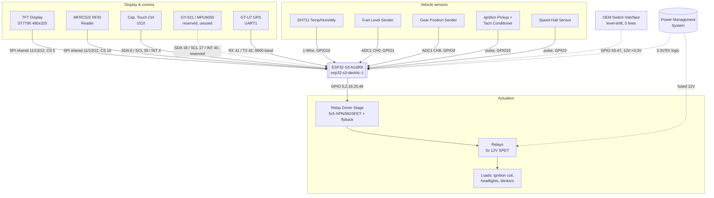

# Wiring & Power Reference

PCB design reference for the `ESP32` branch. MCU is an **ESP32-S3-N16R8** on an
`esp32-s3-devkitc-1` board (16MB flash / 8MB PSRAM). Generated from
[`lib/pinMap.h`](lib/pinMap.h), [`src/main.cpp`](src/main.cpp) and
[`src/RelayControl.cpp`](src/RelayControl.cpp) — not a fabrication-ready schematic.

## System signal interconnect

Dashed links need interface circuitry beyond a direct GPIO wire — see
[Design notes](#design-notes).

## Power management system

The logic side (top) and the relay/load side (bottom) run on separate fused
branches off the same protected 12V node, tied to one ground reference.

## Pin reference

### TFT Display — ST7796, SPI

| Signal | GPIO | Note |
|---|---|---|
| CS | 5 | chip select |
| DC | 6 | data/command |
| RST | 7 | reset |
| BL | 21 | backlight, PWM |
| MOSI | 11 | shared with MFRC522 |
| MISO | 13 | shared with MFRC522 |
| SCK | 12 | shared with MFRC522 |

### MFRC522 RFID — SPI

| Signal | GPIO | Note |
|---|---|---|
| CS | 10 | chip select |
| RST | 38 | reset |
| IRQ | 14 | card-present interrupt |
| MOSI | 11 | shared with TFT |
| MISO | 13 | shared with TFT |
| SCK | 12 | shared with TFT |

### Capacitive touch controller — I2C0

| Signal | GPIO | Note |
|---|---|---|
| SDA | 8 | — |
| SCL | 39 | — |
| INT | 4 | touch interrupt |
| RST | — | not connected (-1) |

### GY-521 / MPU6050 — I2C1, reserved

| Signal | GPIO | Note |
|---|---|---|
| SDA | 18 | defined, unused |
| SCL | 17 | defined, unused |
| INT | 40 | defined, unused |

Not initialized by current firmware — route the footprint only if the IMU is planned.

### GT-U7 GPS — UART1

| Signal | GPIO | Note |
|---|---|---|
| RX (MCU) | 41 | ← GPS TX |
| TX (MCU) | 42 | → GPS RX |

9600 baud, `Serial1`.

### Vehicle sensors

| Signal | GPIO | Note |
|---|---|---|
| DHT11 data | 16 | 1-Wire, needs pull-up |
| Fuel level | 1 | ADC1_CH0 |
| Gear position | 9 | ADC1_CH8 |
| Tach pulse | 15 | via conditioner, RISING |
| Speed (Hall) | 3 | RISING, 6 magnets/rev |

### OEM switch inputs — needs level shift

| Signal | GPIO | Note |
|---|---|---|
| Turn signal L | 43 | active-low, pull-up |
| Turn signal R | 44 | active-low, pull-up |
| Hazard | 45 | active-low, pull-up |
| High beam sense | 46 | active-low, pull-up |
| Low beam sense | 47 | active-low, pull-up |

### Control outputs — to relay drivers

| Signal | GPIO | Note |
|---|---|---|
| Ignition relay | 2 | RFID-gated immobilizer |
| High beam relay | 0 | boot-strap pin, note 9 |
| Low beam relay | 19 | USB D-, unused as USB here |
| Left blinker relay | 20 | USB D+, unused as USB here |
| Right blinker relay | 48 | devkit onboard RGB LED, note 10 |

## Design notes

1. **Power the MCU from the battery directly, not through the ignition switch.**
   The firmware treats `IGNITION_CONTROL_PIN` as an RFID-gated immobilizer relay
   (see `readPICC()` / `bikeIgnitionOn` in `main.cpp`) — the board has to already
   be powered and running before a card tap can arm ignition. Budget for the
   ESP32-S3's parked-bike current draw, and consider a sleep mode if battery
   drain becomes a concern.
2. **OEM switch inputs need level-shifting.** Turn signals, hazard, and headlight
   sense (GPIO43–47) carry the bike's raw 12V switched logic. Don't wire the
   harness straight to the ESP32-S3 — its GPIOs are 3.3V-tolerant only. Step
   each line down through a resistor divider (clamped near 3V) or an
   optocoupler, with a small RC filter for switch bounce and ignition noise.
3. **Relay coils need a driver stage.** They're switched to ground, not powered
   from a GPIO. A GPIO sources only a few mA; automotive relay coils typically
   pull 60–150mA at 12V. Give the five relay-control lines (GPIO 0, 2, 19, 20,
   48) their own low-side NPN/MOSFET driver each — or one ULN2803A octal driver
   for all five — with a flyback diode across every coil.
4. **The ignition pickup can ring well above 12V.** Route the signal feeding
   `TACH_PIN` (GPIO15) through a clamped divider or opto-isolator; never land
   the raw coil lead directly on the MCU pin.
5. **SPI bus is shared.** TFT and MFRC522 share one SPI bus (MOSI 11 / MISO 13 /
   SCK 12) with independent chip-selects (TFT CS 5, RFID CS 10). Keep that
   trace group short and length-matched, and give both CS lines pull-ups so
   they idle high before firmware configures the pins at boot.
6. **IMU pins are reserved, not wired up.** GY-521/MPU6050 pins (SDA 18, SCL
   17, INT 40) are reserved in the pinmap, but current firmware never calls
   `Wire1.begin()` for them. Route the footprint if the IMU is planned;
   otherwise it's dead weight on the board.
7. **Analog senders must stay on ADC1.** Fuel and gear inputs need GPIO1–10.
   ADC2 is unusable on the S3 once Wi-Fi is active, so don't relocate these
   pins there even if layout gets tight.
8. **Confirm sender scaling.** Fuel and gear sender voltages come straight off
   resistive dividers in the bike's wiring. Confirm they're already scaled to
   0–3.3V before reaching the ADC pins; add your own divider if the sender can
   swing higher.
9. **GPIO0 is a boot-strap pin.** It's reused here to drive the high-beam
   relay. Keep any pull resistor on that net light enough that it doesn't
   interfere with boot-mode sensing at power-up, and don't let a load hold it
   low through reset.
10. **GPIO48 doubles as the devkit's status LED.** On the reference
    ESP32-S3-DevKitC-1 module this pin also drives the onboard addressable RGB
    LED. Irrelevant on a bare module or a custom board — but worth knowing if
    you're bench-testing on the devkit before the PCB is populated.
11. **Use a star ground.** Tie battery negative, chassis, and logic ground
    together at one point near the power stage. It keeps relay switching noise
    off the 3.3V sensor and ADC rail.
